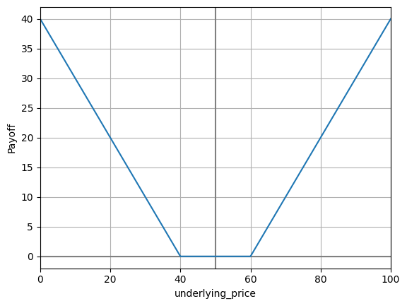
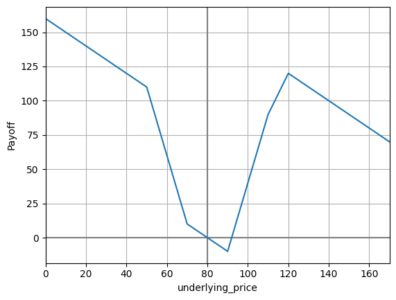
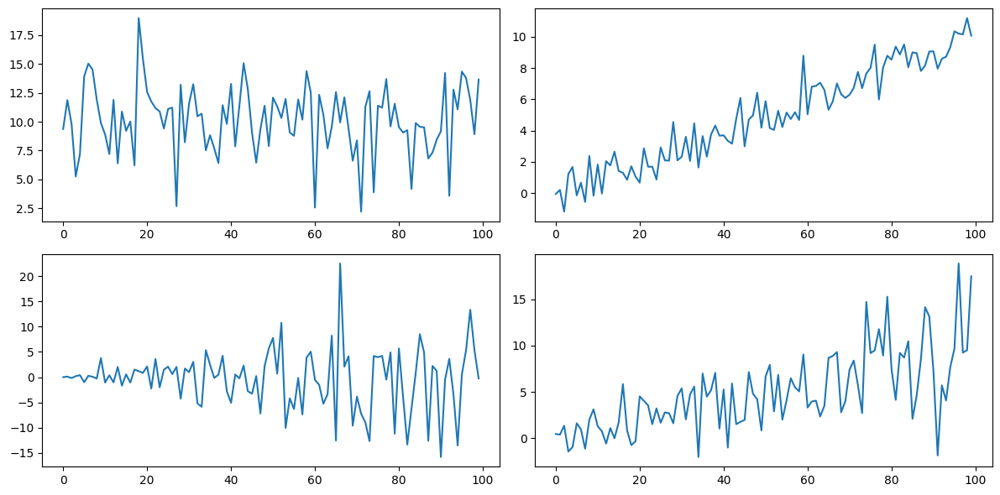
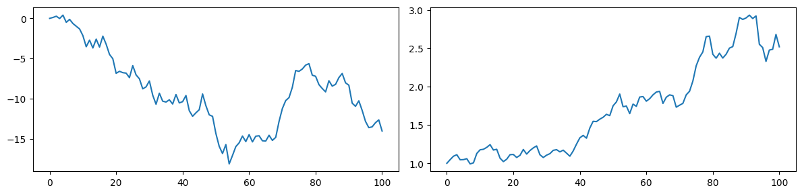
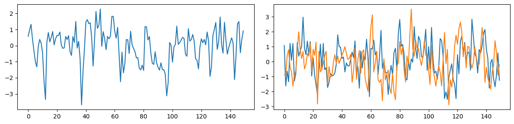
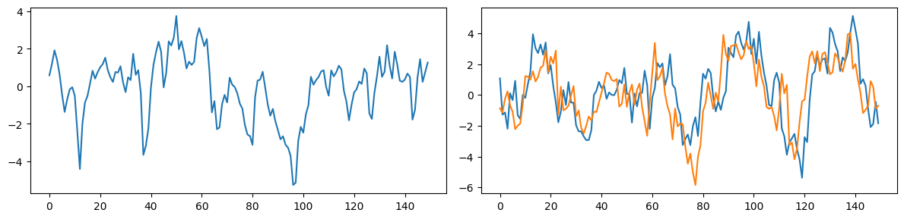
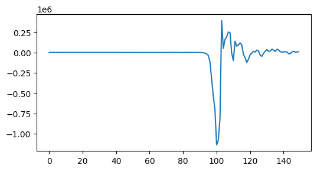
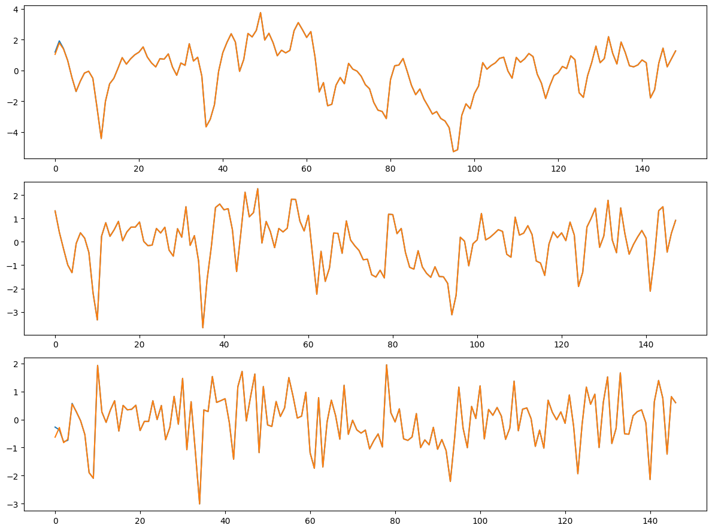
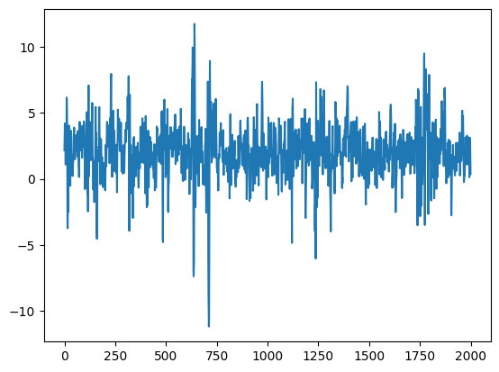
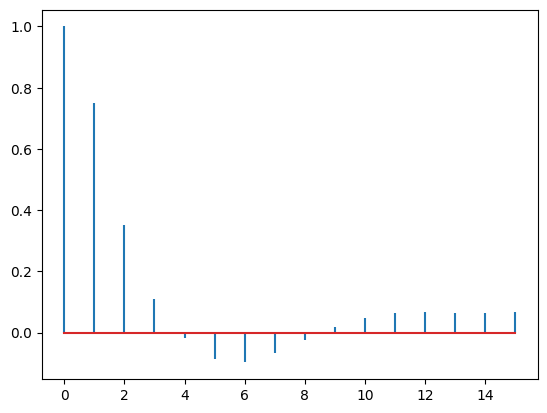

**QFinPy** is a powerful, easy-to-use Python library designed for quantitative finance research, analysis, and modeling. It provides a set of tools for creating options payoff diagrams, pricing derivatives, Monte Carlo Simulations, time series analysis, and  constructing portfolios.

## Installation
pip install qfinpy

## Usage and Examples


```python
import qfinpy as qf
import numpy as np
import matplotlib.pyplot as plt
```

## Options

### Black Scholes Option Pricing and Greeks

qf.**black_scholes_value**(type, strike, t, u_price, vol, rf_rate, u_yield=0)\
    Computes Black Scholes option price\
        **Parameters**\
            **type**\
                'C' (European Calls), 'P' (European Puts), 'BC' (Binary Calls), and 'BP' (Binary Puts) \
            **strike**\
                strike/exersise price \
            **t**\
                time to exersise \
            **u_price**\
                underlying asset price \
            **vol**\
                underlying asset volatility \
            **rf_rate**\
                risk-free rate of interest \
            **u_yield**\
                continuous dividend yield on the asset \
        **Returns**\
            option price \
qf.**black_scholes_gamma**(type, strike, t, u_price, vol, rf_rate, u_yield=0) \
qf.**black_scholes_theta**(type, strike, t, u_price, vol, rf_rate, u_yield=0) \
qf.**black_scholes_speed**(type, strike, t, u_price, vol, rf_rate, u_yield=0) \
qf.**black_scholes_vega**(type, strike, t, u_price, vol, rf_rate, u_yield=0) \
qf.**black_scholes_rho**(type, strike, t, u_price, vol, rf_rate, u_yield=0) \
qf.**black_scholes_yield_sensitivity**(type, strike, t, u_price, vol, rf_rate, u_yield=0) \
\
**Example**\
    European Call option with \
    strike = 95 \
    t = 3/12 \
    u_price = 100 \
    vol = 0.50 \
    rf_rate = 0.01 \
    u_yield=0


```python
value = qf.black_scholes_value('C', 95, 3/12, 100, 0.50, 0.01, u_yield=0)
delta = qf.black_scholes_delta('C', 95, 3/12, 100, 0.50, 0.01, u_yield=0) 
gamma = qf.black_scholes_gamma('C', 95, 3/12, 100, 0.50, 0.01, u_yield=0) 
theta = qf.black_scholes_theta('C', 95, 3/12, 100, 0.50, 0.01, u_yield=0) 
speed = qf.black_scholes_speed('C', 95, 3/12, 100, 0.50, 0.01, u_yield=0) 
vega = qf.black_scholes_vega('C', 95, 3/12, 100, 0.50, 0.01, u_yield=0) 
rho = qf.black_scholes_rho('C', 95, 3/12, 100, 0.50, 0.01, u_yield=0) 
yield_sensitivity = qf.black_scholes_yield_sensitivity('C', 95, 3/12, 100, 0.50, 0.01, u_yield=0) 
print('option value = ', value) 
print('delta = ', delta) 
print('gamma = ', gamma) 
print('theta = ', theta) 
print('speed = ', speed) 
print('vega = ', vega) 
print('rho = ', rho) 
print('yield_sensitivity = ', yield_sensitivity)
```

    option value =  12.527923392521458
    delta =  0.633136941899257
    gamma =  0.015060599447748629
    theta =  -19.33360701765983
    speed =  -0.000355534473275545
    vega =  18.825749309685786
    rho =  12.69644269935106
    yield_sensitivity =  -15.828423547481425


```python
strike = [90, 95, 100, 105]
qf.black_scholes_value('C', strike, 3/12, 100, 0.50, 0.01, u_yield=0)
```


    array([15.41103735, 12.52792339, 10.060564  ,  7.98750626])


### Options Payoff Diagrams

qf.**options_payoff_diagram**(folio, u_price=None)\
    Plots option payoff diagram\
        **Parameters**\
            **folio**\
                Class - C (European Calls), P (European Puts), BC (Binary Calls), and BP (Binary Puts)-\
                needs to be instantiated using strike price.\
                The S (stock) class doesn't require strike price.\
            **u_price**\
                underlying asset price optional with others but required when S (stock) is included.


```python
# European Call with strike 60 and European Put with strike 40, and current underlying price at 50.
folio = qf.C(60) + qf.P(40)
qf.options_payoff_diagram(folio, 50)
```


    

    


```python
# 4 P(50) short, 4 P(70) long, 6 C(90) long, 2 C(110) short, 4 C(120) short and 1 S() short.
folio = -4*qf.P(50) + 4*qf.P(70) + 6*qf.C(90) - 2*qf.C(110) - 4*qf.C(120) - qf.S() 
qf.options_payoff_diagram(folio, u_price=80)
```


    

    


### Implied Volatility

qf.**implied_volatility**(type, deriv_price, strike, t, u_price, rf_rate, u_yield=0, x0=0.1, tol=1.48e-08) \
    Computes implied volatility using Newton's method.\
        **Parameters**\
            **type**\
                'C' (European Calls), 'P' (European Puts), 'BC' (Binary Calls), and 'BP' (Binary Puts) \
            **strike**\
                strike/exersise price \
            **t**\
                time to exersise \
            **u_price**\
                underlying asset price \
            **rf_rate**\
                risk-free rate of interest \
            **u_yield**\
                continuous dividend yield on the asset \
            **x0**\
                initial guess of implied volatility in the Newton's method \
            **tol**\
                tol in the Newton's method \
        **Returns**\
            implied volatility


```python
imp_vol = qf.implied_volatility('C', 2.00, 50, 32/365, 51.25, 0.05) 
print('Implied volatility = ', imp_vol)
```

    Implied volatility =  0.1869228434755648


## Portfolio Optimization

qf.**portfolio_optim**(m, c, expected_return=None, shortable=None, rf_rate=None, allow_borrow=False, max_leverage=1.0e3) \
    Computes implied volatility using Newton's method.\
        **Parameters**\
            **m**\
                Array of returns of assets \
            **c**\
                Covariance matrix of assets \
            **expected_return**\
                expected returns of the portfolio \
            **shortable**\
                list of 0's and 1's were 1's represent the corresponding assets that can be shorted \
            **rf_rate**\
                risk-free rate of interest \
            **allow_borrow**\
                 Allow risk-free asset to be borrowed \
            **max_leverage**\
                Maximum leverage \
        **Returns**\
            Array of portfolio weights


```python
m = np.array([0.0890833, 0.213667, 0.234583])
c = np.array([[0.01080754, 0.01240721, 0.01307513],
     [0.01240721, 0.05839170, 0.05542639],
     [0.01307513, 0.05542639, 0.09422681]])
```


```python
result = qf.portfolio_optim(m, c, expected_return=0.15)
result.x
```


    array([0.53009592, 0.35639219, 0.11351195])


## Monte Carlo Simulation

### Random series generation

qf.**normal**(*n, mu=np.array([0.0]), sigma=np.array([1.0]), bs=None, dtype=np.float64) \
    Normal random numbers.\
        **Parameters**\
            **n**\
                Number of samples \
            **mu**\
                mean: array of shape () or (n,) or bs+(1,) or bs+(n,) \
            **sigma**\
                standard deviation: array of shape () or (1) or (n,) or bs+(1,) or bs+(n,) \
            **bs**\
                batch size/shape - int or tuple of ints \
            **dtype**\
                Data type \
        **Returns**\
            Array


```python
x = qf.normal(10)
print(x)
```

    [ 0.18154002  0.31673467 -0.32292367 -1.60481149  0.3911569   1.83995284
      0.91129737  0.70276103 -1.24188547  0.53398237]


```python
fig, ax = plt.subplots(2, 2, figsize=(12, 6))
ax[0,0].plot(qf.normal(100, mu=10.0, sigma=3.0))
ax[0,1].plot(qf.normal(mu=np.linspace(0,10,100), sigma=1.0))
ax[1,0].plot(qf.normal(mu=0, sigma=np.linspace(0,10,100)))
ax[1,1].plot(qf.normal(mu=np.linspace(0,10,100), sigma=np.linspace(1,5,100)))
plt.tight_layout()
plt.show()
```


    

    


```python
x = qf.normal(10, bs=2)
print(x.shape)
print(x)
```

    (2, 10)
    [[-1.13429421  0.15058132 -1.08052488  1.15742976  0.45521039  1.14701645
      -1.33337457 -1.23322412  1.18004075  1.2100994 ]
     [ 0.91674181 -0.82460509 -0.07455992 -0.45408118 -0.69226637  0.8686709
       1.30844451  0.64410671 -1.23337705 -1.54256031]]


```python
x = qf.normal(20, bs=(2,3))
print(x.shape)
```

    (2, 3, 20)


qf.**normal_multivariate**(*n, mu=np.zeros(2), cov=np.eye(2), bs=None, dtype=np.float64) \
    Multivariate normal random numbers.\
        **Parameters**\
            **n**\
                Number of samples \
            **mu**\
                mean:  array of shape (k) or (k,n) or bs+(k,1) or bs+(k,n) \
            **cov**\
                covariance: array of shape (k,k) or (k,k,n) or bs+(k,k,1) or bs+(k,k,n) \
            **bs**\
                batch size/shape - int or tuple of ints \
            **dtype**\
                Data type \
        **Returns**\
            Array


```python
qf.normal_multivariate(5, mu=[1,10], cov=[[1,0.5],[0.5,2]])
```


    array([[ 0.42347332,  2.01860109,  1.55583432,  0.75340141,  1.03875338],
           [ 9.39891857, 11.55839106, 11.08558735, 11.28719955,  8.35907042]])


qf.**lognormal**(*n, mu=np.array([0.0]), sigma=np.array([1.0]), bs=None, dtype=np.float64) \
qf.**lognormal_multivariate**(*n, mu=np.zeros(2), cov=np.eye(2), bs=None, dtype=np.float64) \
qf.**students_t**(*n, df, mu=None, sigma=None, bs=None, dtype=np.float64)

### Random Walk

qf.**random_walk**(series, x0=0.0) \
    Generates Additive Random Walk from a given series.\
        **Parameters**\
            **series**\
                array of steps \
            **x0**\
                starting point \
        **Returns**\
            Array

qf.**random_walk_geometric**(series, x0=0.0) \
    Generates Geometric Random Walk from a given series.\
        **Parameters**\
            **series**\
                array of returns \
            **x0**\
                starting point \
        **Returns**\
            Array


```python
fig, ax = plt.subplots(1, 2, figsize=(12, 3))
ret = qf.normal(100)
ax[0].plot(qf.random_walk(ret, x0=0.0))

ret = qf.normal(100, mu=0.005, sigma=0.05)
ax[1].plot(qf.random_walk_geometric(ret, x0=1.0))

plt.tight_layout()
plt.show()
```


    

    


#### Example: Monte Carlo Option Pricing


```python
strike = 95
t = 3/12
u_price = 100
vol = 0.50
rf_rate = 0.01
```


```python
n=1000
bs=10000
mu = rf_rate*t/n
sigma = vol*(t/n)**0.5
ret = qf.normal(n, mu=mu, sigma=sigma, bs=bs)
sim = qf.random_walk_geometric(ret, x0=u_price)
value = qf.present_value(np.maximum(0, sim[:,-1] - strike).mean(), rf_rate, t)
print(value)
```

    12.622487639061811


```python
# using lognormal if intermediate values are not required
n=1
bs=1000000
sigma = vol*(t**0.5)
mu = rf_rate*t - (sigma**2)/2
sim = u_price * qf.lognormal(n, mu=mu, sigma=sigma, bs=bs)
value = qf.present_value(np.maximum(0, sim - strike).mean(), rf_rate, t)
print('option value = ', value)
```

    option value =  12.541410936059899


## Time Series Analysis

### MA(q), AR(p), GARCH(rs)

qf.tsa.**ma**(series, theta, mu=0.0, e0=None) \
    Generates Moving Average MA(q) from a given series of error terms.\
        **Parameters**\
            **series**\
                array of error terms \
            **theta**\
                array of MA coefficients (univariate/multivariate) \
            **mu**\
                mean of the process \
            **e0**\
                (optional) initial values of error terms \
        **Returns**\
            Array


```python
fig, ax = plt.subplots(1, 2, figsize=(12, 3))
e = qf.normal(150)
theta = [0.6, 0.2, 0.1]
w = qf.tsa.ma(e, theta, mu=0.0)
ax[0].plot(w)

e_m = qf.normal_multivariate(150, mu=np.zeros(2), cov=np.eye(2))
theta_m = [[[0.3,0.1],[0.1,0.3]], [[0.2,0.1],[0.1,0.2]], [[0.1,0.1],[0.1,0.1]]]
w_m = qf.tsa.ma(e_m, theta_m)
ax[1].plot(w_m[0])
ax[1].plot(w_m[1])

plt.tight_layout()
plt.show()
```


    

    


qf.tsa.**ar**(series, phi, mu=0.0, x0=None) \
    Generates Autoregrassive AR(p) from a given series of error terms.\
        **Parameters**\
            **series**\
                array of error terms \
            **phi**\
                array of MA coefficients (univariate/multivariate) \
            **mu**\
                mean of the process \
            **x0**\
                (optional) initial values for the generated series \
        **Returns**\
            Array


```python
fig, ax = plt.subplots(1, 2, figsize=(12, 3))

phi = [0.4, 0.2]
x = qf.tsa.ar(w, phi, mu=0.0)
ax[0].plot(x)

phi_m = [[[0.4, 0.1],[0.1,0.4]], [[0.2, 0.1],[0.1,0.2]]]
x_m = qf.tsa.ar(w_m, phi_m)
ax[1].plot(x_m[0])
ax[1].plot(x_m[1])

plt.tight_layout()
plt.show()
```


    

    


qf.tsa.**gh**(series, w, alpha, beta, x0=None, e0=None, mu=0, initial_var=None) \
    Generates GARCH(r,s) from a given series of shocks.\
        **Parameters**\
            **series**\
                array of shocks \
            **w**\
                GARCH omega coefficient \
            **alpha**\
                array of GARCH alpha coefficients \
            **beta**\
                array of GARCH beta coefficients \
        **Returns**\
            Array


```python
fig, ax = plt.subplots(1, 1, figsize=(6, 3))

g = qf.tsa.gh(x, 0.01, 0.3, 0.6, mu=0)
ax.plot(g[0])
plt.show()
```


    

    


### Inverse GARCH, MA and AR

qf.tsa.**ma_inverse**(series, theta, mu=0.0) \
qf.tsa.**ar_inverse**(series, phi, mu=0.0) \
qf.tsa.**gh_inverse**(series, w, alpha, beta, mu=0, initial_var=None)


```python
inverse_g = qf.tsa.gh_inverse(g[0], 0.01, 0.3, 0.6, mu=0)
inverse_x = qf.tsa.ar_inverse(x, phi)
inverse_w = qf.tsa.ma_inverse(w, theta)
```


```python
fig, ax = plt.subplots(3, 1, figsize=(12, 9))

ax[0].plot(x[1:])
ax[0].plot(inverse_g[0])

ax[1].plot(w[2:])
ax[1].plot(inverse_x)

ax[2].plot(e[-147:])
ax[2].plot(inverse_w)

plt.tight_layout()
plt.show()
```


    

    


#### Example: ARMA(1,1) + GARCH(1,1) fit using the inverse functions


```python
# simulated data
e = qf.tsa.gh(qf.normal(2000), w=0.1, alpha=0.3, beta=0.6)[0]
w = qf.tsa.ma(e, theta=0.8)
data = qf.tsa.ar(w, phi=0.5, mu=2.0)
```


```python
plt.plot(data)
plt.show()
```


    

    


```python
from scipy.optimize import minimize
```


```python
def arma_1_1_garch_1_1_log_likelihood(params, data):
    # Parameters
    mu, phi, theta, omega, alpha, beta = params

    N = len(data)
    w = qf.tsa.ar_inverse(data-mu, phi=phi)
    e = qf.tsa.ma_inverse(w, theta=theta)
    z, sigma2 = qf.tsa.gh_inverse(e, w=omega, alpha=alpha, beta=beta, initial_var=e.var())

    log_likelihood = -0.5 * N * np.log(2 * np.pi)
    log_likelihood -= 0.5 * np.sum(np.log(sigma2) + z**2)
    return -log_likelihood  # Negative log-likelihood for minimization

# Initial parameter guess 
initial_params = [0.0, 0.1, 0.1, 0.1, 0.1, 0.1]

bounds = [
    (None, None),  # mu
    (-1, 1),       # phi1
    (None, None),  # theta12
    (1e-8, None),  # omega > 0
    (1e-8, 1),     # 0 <= alpha <= 1
    (1e-8, 1)      # 0 <= beta <= 1
]

y = data
# Optimize log-likelihood
result = minimize(arma_1_1_garch_1_1_log_likelihood, initial_params, args=(y,), bounds=bounds)
fitted_params = result.x

print("Fitted Parameters:", fitted_params)
print("fitted_log_likelihood = ", - result.fun)
print("AIC = ", -2 * -result.fun + 2 * len(result.x))
print("BIC = ", -2 * -result.fun + len(result.x) * np.log(y.size).item())
```

    Fitted Parameters: [1.96580572 0.51264211 0.81711844 0.11108173 0.30637581 0.59625152]
    fitted_log_likelihood =  -2667.169619712167
    AIC =  5346.339239424334
    BIC =  5379.944654181586


### Autovariance and Autocorrelation

qf.tsa.**acovf**(series, nlags) \
    Generates autocovariance function upto lag nlags.\
        **Parameters**\
            **series**\
                array to compute acovf \
            **nlags**\
                number of lags \
        **Returns**\
            Array

qf.tsa.**acf**(series, nlags, qstat=False, dof_offset=0) \
    Generates autocorrelation function upto lag nlags.\
        **Parameters**\
            **series**\
                array to compute acf \
            **nlags**\
                number of lags \
            **qstat**\
                returns Ljung-Box Q statistics and corresponding p-values \
            **dof_offset**\
                reduce the dof by dof_offset in chi-squared dist when computing p-values \
        **Returns**\
            Array


```python
qf.tsa.acf(data, nlags=5, qstat=True)
```


    (array([ 1.        ,  0.75152151,  0.35123663,  0.11129135, -0.01846672,
            -0.08558957]),
     array([1131.26435655, 1378.49265814, 1403.3262097 , 1404.01029911,
            1418.71285597]),
     array([0., 0., 0., 0., 0.]))


```python
data_acf = qf.tsa.acf(data, nlags=15)
plt.stem(data_acf, markerfmt='')
plt.show()
```


    

    


## Other Tools

qf.**sliding_window**(a, window)\
qf.**normal_cdf**(x, mu=0.0, sigma=1.0)\
qf.**normal_pdf**(x, mu=0.0, sigma=1.0)\
qf.**chi2_cdf**(x, df)\
qf.**chi2_pdf**(x, df)\
qf.**trimmed_mean**(series, trim=None, axis=-1)\
qf.**mad**(series, calib=1.4826, axis=-1)\
    Mean absolute deviation\
qf.**pct_change**(series, axis=-1)\
qf.**log_change**(series, axis=-1)


```python

```
