# Introduction
QFinPy is a powerful, easy-to-use Python library designed for quantitative finance research, analysis, and modeling. It provides a set of tools for creating options payoff diagrams, pricing derivatives, Monte Carlo Simulations, time series analysis, and  constructing portfolios.

# Installation
pip install qfinpy

# Usage and Examples


```python
import qfinpy as qf
import numpy as np
import matplotlib.pyplot as plt
```

## Interest Rate
rate_to_continuous(r, t=1, compounded=1) \
rate_to_compounded(r, t) \
future_value(M, r, T, a=0.0) \
present_value(M, r, T) 

A nominal interest rate of 8% per year compounded quarterly --> continuously compounded rate --> effective annual rate (EAR)


```python
r = qf.rate_to_continuous(0.08, t=1, compounded=1/4)
print('continuous rate = ', r)
ear = qf.math.exp(r) - 1
print('effective annual rate = ', ear)
```

    continuous rate =  0.07921050918471892
    effective annual rate =  0.08243215999999998


Continuously compounded rate --> quarterly rate --> nominal yearly rate


```python
r_quarterly = qf.rate_to_compounded(r, 1/4)
print('3 months rate = ', r_quarterly)
# Nominal annual rate
r_quarterly_nominal = 4 * r_quarterly
print('Nominal annual rate = ', r_quarterly_nominal)
```

    3 months rate =  0.020000000000000018
    Nominal annual rate =  0.08000000000000007


Present and Future Values: 1000 units invested for a period of 10 years at a continuously compounded rate of 7%. (future_value function also takes an optional argument 'a', which is the continuous deposit rate)


```python
fv = qf.future_value(1000, 0.07, 10)
print('Future value = ', fv)
```

    Future value =  2013.7527074704767


```python
pv = qf.present_value(fv, 0.07, 10)
print('Present value = ', pv)
```

    Present value =  1000.0


## Options

### Options Payoff Diagrams
C (European Calls), P (European Puts), BC (Binary Calls), and BP (Binary Puts) classes needs to be instantiated using strike price. The S (stock) class doesn't require strike price.
The function options_payoff_diagram takes an optional argument 'u_price' for the current underlying price. u_price is required when S (stock) is included.

European Call with strike 100


```python
qf.options_payoff_diagram(qf.C(100))
```


    
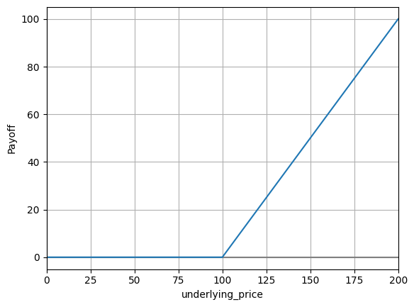
    


European Call with strike 60 and European Put with strike 40, and current underlying price at 50.


```python
folio = qf.C(60) + qf.P(40)
qf.options_payoff_diagram(folio, 50)
```


    

    


4 P(50) short, 4 P(70) long, 6 C(90) long, 2 C(110) short, 4 C(120) short and 1 S() short.


```python
folio = -4*qf.P(50) + 4*qf.P(70) + 6*qf.C(90) - 2*qf.C(110) - 4*qf.C(120) - qf.S()
qf.options_payoff_diagram(folio, u_price=80)
```


    

    


### Black Scholes Oprion Pricing and Greeks
black_scholes_value(type, strike, t, u_price, vol, rf_rate, u_yield=0) \
&emsp; type: 'C' (European Calls), 'P' (European Puts), 'BC' (Binary Calls), and 'BP' (Binary Puts) \
&emsp; strike: strike/exersise price \
&emsp; t: time to exersise \
&emsp; u_price: underlying asset price \
&emsp; vol: underlying asset volatility \
&emsp; rf_rate: riskfree rate of interest \
&emsp; u_yield: continuous dividend yield on the asset \
\
black_scholes_delta(type, strike, t, u_price, vol, rf_rate, u_yield=0) \
black_scholes_gamma(type, strike, t, u_price, vol, rf_rate, u_yield=0) \
black_scholes_theta(type, strike, t, u_price, vol, rf_rate, u_yield=0) \
black_scholes_speed(type, strike, t, u_price, vol, rf_rate, u_yield=0) \
black_scholes_vega(type, strike, t, u_price, vol, rf_rate, u_yield=0) \
black_scholes_rho(type, strike, t, u_price, vol, rf_rate, u_yield=0) \
black_scholes_yield_sensitivity(type, strike, t, u_price, vol, rf_rate, u_yield=0)

Example: European Call option with \
strike = 95 \
t = 3/12 \
u_price = 100 \
vol = 0.50 \
rf_rate = 0.01 \
u_yield=0 


```python
value = qf.black_scholes_value('C', 95, 3/12, 100, 0.50, 0.01, u_yield=0)
delta = qf.black_scholes_delta('C', 95, 3/12, 100, 0.50, 0.01, u_yield=0)
gamma = qf.black_scholes_gamma('C', 95, 3/12, 100, 0.50, 0.01, u_yield=0)
theta = qf.black_scholes_theta('C', 95, 3/12, 100, 0.50, 0.01, u_yield=0)
speed = qf.black_scholes_speed('C', 95, 3/12, 100, 0.50, 0.01, u_yield=0)
vega = qf.black_scholes_vega('C', 95, 3/12, 100, 0.50, 0.01, u_yield=0)
rho = qf.black_scholes_rho('C', 95, 3/12, 100, 0.50, 0.01, u_yield=0)
yield_sensitivity = qf.black_scholes_yield_sensitivity('C', 95, 3/12, 100, 0.50, 0.01, u_yield=0)
print('option value = ', value)
print('delta = ', delta)
print('gamma = ', gamma)
print('theta = ', theta)
print('speed = ', speed)
print('vega = ', vega)
print('rho = ', rho)
print('yield_sensitivity = ', yield_sensitivity)
```

    option value =  12.527923392521458
    delta =  0.633136941899257
    gamma =  0.015060599447748629
    theta =  -19.33360701765983
    speed =  -0.000355534473275545
    vega =  18.825749309685786
    rho =  12.69644269935106
    yield_sensitivity =  -15.828423547481425


### Implied Volatility
implied_volatility(type, deriv_price, strike, t, u_price, rf_rate, u_yield=0, x0=0.1, tol=1.48e-08) \
&emsp; type: 'C' (European Calls), 'P' (European Puts), 'BC' (Binary Calls), and 'BP' (Binary Puts) \
&emsp; deriv_price: Current market price of the option \
&emsp; strike: strike/exersise price \
&emsp; t: time to exersise \
&emsp; u_price: underlying asset price \
&emsp; rf_rate: risk-free rate of interest \
&emsp; u_yield: continuous dividend yield on the asset \
&emsp; x0: initial guess of implied volatility in the Newton's method \
&emsp; tol: tol in the Newton's method 

Example: A European call option, with a strike price of 50 expires in 32 days. The risk-free interest rate is 0.05 and the stock is currently trading at 51.25 and the current market price of the option is $2.00. Using a standard Black–Scholes pricing model, the volatility implied by the market price is 0.187


```python
imp_vol = qf.implied_volatility('C', 2.00, 50, 32/365, 51.25, 0.05)
print('Implied volatility = ', imp_vol)
```

    Implied volatility =  0.1869228434755648


## Portfolio Optimization

portfolio_optim(m, c, expected_return=None, shortable=None, rf_rate=None, allow_borrow=False, max_leverage=1.0e3) \
&emsp; m: Returns of assets \
&emsp; c: covariance of assets \
&emsp; expected_return: expected returns for the portfolio \
&emsp; shortable: list of 0's and 1's were 1's represent the assets that can be shorted \
&emsp; rf_rate: risk-free rate \
&emsp; allow_borrow: Allow risk-free asset to be borrowed \
&emsp; max_leverage: Maximum leverage


```python
m = np.array([0.0890833, 0.213667, 0.234583])
c = np.array([[0.01080754, 0.01240721, 0.01307513],
     [0.01240721, 0.05839170, 0.05542639],
     [0.01307513, 0.05542639, 0.09422681]])
```


```python
result = qf.portfolio_optim(m, c, expected_return=0.15)
result.x
```


    array([0.53009593, 0.35639213, 0.113512  ])


## Monte Carlo Simulation

### Random series generation

#### Normal random numbers
normal(*n, mu=np.array([0.0]), sigma=np.array([1.0]), bs=None, dtype=np.float64) \
&emsp; n: Number of samples \
&emsp; mu: mean - array of shape () or (n,) or bs+(1,) or bs+(n,) \
&emsp; sigma: standard deviation - array of shape () or (1) or (n,) or bs+(1,) or bs+(n,) \
&emsp; bs: batch size/shape - int or tuple of ints \
&emsp; dtype: dtype


```python
x = qf.normal(10)
print(x)
```

    [-0.29769324 -0.54351292 -0.34507348  0.48251412  0.22500892  0.87064283
     -0.50450492  0.30324753  1.15314968 -0.67326597]


```python
plt.plot(qf.normal(100, mu=10.0, sigma=3.0))
```


    [<matplotlib.lines.Line2D at 0x7f10ff9951c0>]


    
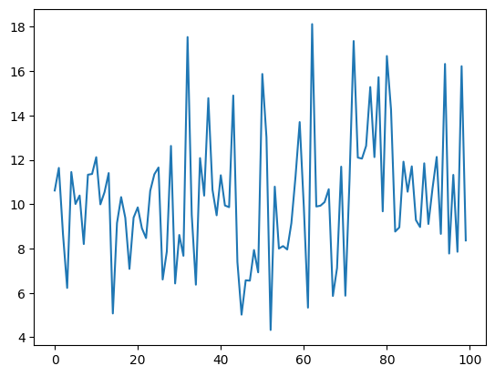
    


```python
plt.plot(qf.normal(mu=np.linspace(0,10,100), sigma=1.0))
```


    [<matplotlib.lines.Line2D at 0x7f1155fdf3b0>]


    
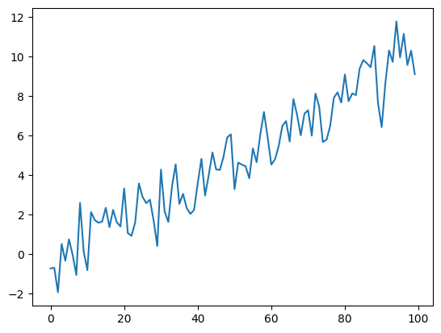
    


```python
plt.plot(qf.normal(mu=0, sigma=np.linspace(0,10,100)))
```


    [<matplotlib.lines.Line2D at 0x7f1100347650>]


    
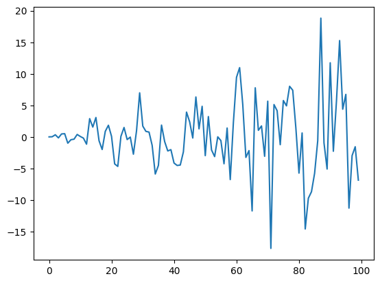
    


```python
plt.plot(qf.normal(mu=np.linspace(0,10,100), sigma=np.linspace(1,5,100)))
```


    [<matplotlib.lines.Line2D at 0x7f11003605f0>]


    
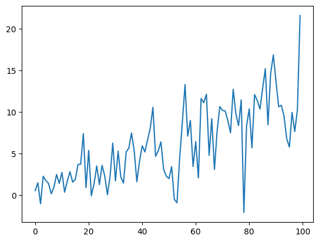
    


```python
x = qf.normal(10, bs=2)
print(x.shape)
print(x)
```

    (2, 10)
    [[ 0.84284109  0.08477504 -2.43723961  0.61270538  0.9801093  -0.52259732
       1.38707595 -0.73983371 -0.66849634  1.46785926]
     [ 0.13333635 -0.90268586  0.56882097  1.1391172   0.2177926   0.41764538
       0.1300695  -0.21647265 -0.32227474 -1.62438587]]


```python
x = qf.normal(20, bs=(2,3))
print(x.shape)
```

    (2, 3, 20)


#### Multivariate normal random variables
normal_multivariate(*n, mu=np.zeros(2), cov=np.eye(2), bs=None, dtype=np.float64) \
&emsp; n: Number of samples \
&emsp; mu: mean - array of shape (k) or (k,n) or bs+(k,1) or bs+(k,n) \
&emsp; cov: covariance - array of shape (k,k) or (k,k,n) or bs+(k,k,1) or bs+(k,k,n) \
&emsp; bs: batch size/shape - int or tuple of ints \
&emsp; dtype: dtype


```python
x = qf.normal_multivariate(10, mu=np.ones(2), cov=np.eye(2))
print(x.shape)
print(x)
```

    (2, 10)
    [[ 0.77333346  0.17601791 -0.01866713  0.46400412  1.51313251 -0.90469188
       0.13323023  1.54159995  0.21370799  1.8932842 ]
     [-0.35885229  0.88045584 -0.19873425  1.01257887  0.45947712 -0.20288216
       0.84080326  2.95304337  0.45257102  1.14213169]]


```python
x = qf.normal_multivariate(mu=np.stack((np.linspace(0,10,100), np.linspace(0,5,100))), cov=[[1,0.5],[0.5,2]])
plt.plot(x[0])
plt.plot(x[1])
plt.show()
```


    

    


```python
x = qf.normal_multivariate(10, mu=np.ones(2), cov=np.eye(2), bs=(5,7))
print(x.shape)
```

    (5, 7, 2, 10)


#### Lognormal (=exp(normal))


```python
x = qf.lognormal(10)
print(x)
```

    [0.50643209 0.23344932 4.29740853 0.77359027 0.72411853 0.21328177
     3.03007789 0.69455528 3.15378758 0.43217616]


```python
x = qf.lognormal_multivariate(10, mu=np.ones(2), cov=np.eye(2), bs=(5,7))
print(x.shape)
```

    (5, 7, 2, 10)


#### Student's t dist


```python
x = qf.students_t(100, df=4, mu=2, sigma=4)
plt.plot(x)
```


    [<matplotlib.lines.Line2D at 0x7669ed65be30>]


    
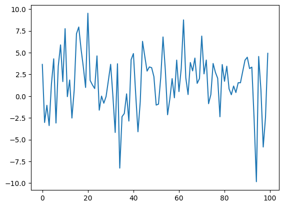
    


### Random Walk

#### Additive Random Walk
random_walk(series, x0=0.0) \
&emsp; series: random step size \
&emsp; x0: starting point


```python
ret = qf.normal(100)
x = qf.random_walk(ret, x0=0.0)
plt.plot(x)
```


    [<matplotlib.lines.Line2D at 0x7f11551a0ef0>]


    
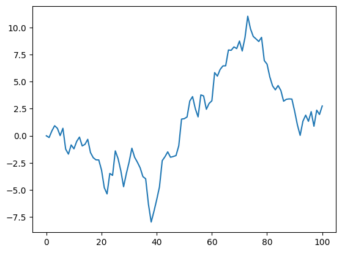
    


#### Geometric Random Walk
random_walk_geometric(series, x0=1.0)
&emsp; series: random returns \
&emsp; x0: starting point


```python
ret = qf.normal(100, mu=0.005, sigma=0.05)
x = qf.random_walk_geometric(ret, x0=1.0)
plt.plot(x)
```


    [<matplotlib.lines.Line2D at 0x7f115516fec0>]


    
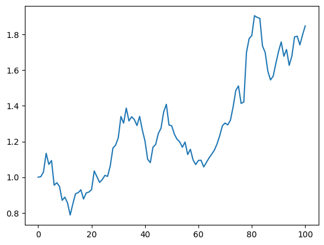
    


### Monte Carlo Option Pricing


```python
strike = 95
t = 3/12
u_price = 100
vol = 0.50
rf_rate = 0.01
```


```python
n=1000
bs=10000
mu = rf_rate*t/n
sigma = vol*(t/n)**0.5
ret = qf.normal(n, mu=mu, sigma=sigma, bs=bs)
sim = qf.random_walk_geometric(ret, x0=u_price)
print(sim.shape)
```

    (10000, 1001)


```python
plt.plot(sim[0])
```


    [<matplotlib.lines.Line2D at 0x7f11550620c0>]


    
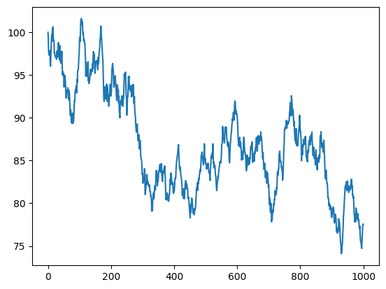
    


```python
value = qf.present_value(np.maximum(0, sim[:,-1] - strike).mean(), rf_rate, t)
print(value)
```

    12.453812729122065


Since intermediate values of geometric random walk are not required for option value calculation, we can use lognormal distribution to save time and memory. In this case standard deviations of both log returns and normal returns are same, but (the mean of log returns) = (mean of normal returns) - (variance of returns)/2


```python
n=1
bs=1000000
sigma = vol*(t**0.5)
mu = rf_rate*t - (sigma**2)/2
sim = u_price * qf.lognormal(n, mu=mu, sigma=sigma, bs=bs)
print(sim.shape)
```

    (1000000, 1)


```python
value = qf.present_value(np.maximum(0, sim - strike).mean(), rf_rate, t)
print('option value = ', value)
```

    option value =  12.527805286619587


## Time Series Analysis


```python
import qfinpy as qf
import numpy as np
import matplotlib.pyplot as plt
```


```python
from qfinpy import tsa
```

### Moving Average MA(q)
ma(series, theta, mu=0.0, e0=None)


```python
e = qf.normal(150, bs=5)
theta = [0.6, 0.2, 0.1]
w = tsa.ma(e, theta, mu=0.0)
print(e.shape)
print(w.shape)
```

    (5, 150)
    (5, 150)


```python
plt.plot(e[0])
```


    [<matplotlib.lines.Line2D at 0x763c1f1878c0>]


    
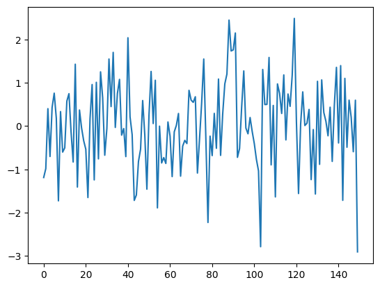
    


```python
plt.plot(w[0])
```


    [<matplotlib.lines.Line2D at 0x763c1f1b7140>]


    
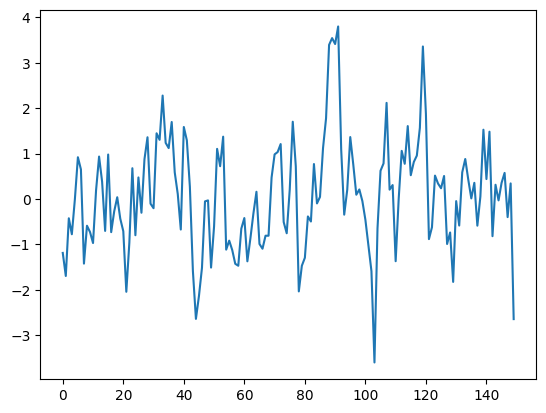
    


```python
e_m = qf.normal_multivariate(150, mu=np.zeros(2), cov=np.eye(2))
theta_m = [[[0.3,0.1],[0.1,0.3]], [[0.2,0.1],[0.1,0.2]], [[0.1,0.1],[0.1,0.1]]]
w_m = tsa.ma(e_m, theta_m)
print(e_m.shape)
print(w_m.shape)
```

    (2, 150)
    (2, 150)


### Autoregrassive AR(p)
ar(series, phi, mu=0.0, x0=None)


```python
phi = [0.4, 0.2]
x = tsa.ar(w, phi, mu=0.0)
print(x.shape)
```

    (5, 150)


```python
plt.plot(x[0])
```


    [<matplotlib.lines.Line2D at 0x763c1dd10bf0>]


    
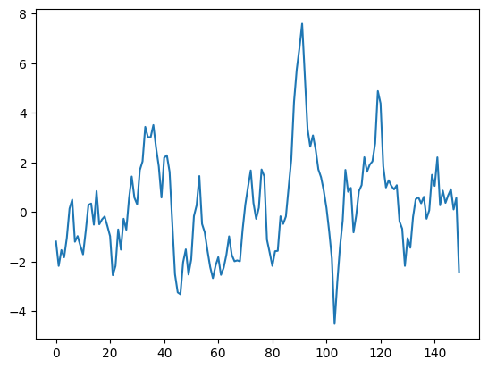
    


```python
phi_m = [[[0.4, 0.1],[0.1,0.4]], [[0.2, 0.1],[0.1,0.2]]]
x_m = tsa.ar(w_m, phi_m)
print(x_m.shape)
```

    (2, 150)


### GARCH(r,s)
gh(series, w, alpha, beta, x0=None, e0=None, mu=0, initial_var=None): \
(returns a tuple containing the series and the volatility)


```python
g = tsa.gh(x, 0.01, 0.3, 0.6, mu=0)
g[0].shape
```


    (5, 150)


```python
plt.plot(g[0][0])
```


    [<matplotlib.lines.Line2D at 0x763c1542e630>]


    
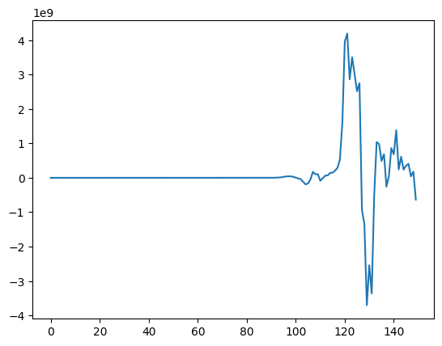
    


### Inverse GARCH, MA and AR
ma_inverse(series, theta, mu=0.0) \
ar_inverse(series, phi, mu=0.0) \
gh_inverse(series, w, alpha, beta, mu=0, initial_var=None)


```python
inverse_g = tsa.gh_inverse(g[0], 0.01, 0.3, 0.6, mu=0)
print(inverse_g[0].shape)
```

    (5, 149)


```python
plt.plot(x[0,1:])
plt.plot(inverse_g[0][0])
```


    [<matplotlib.lines.Line2D at 0x763c153880e0>]


    
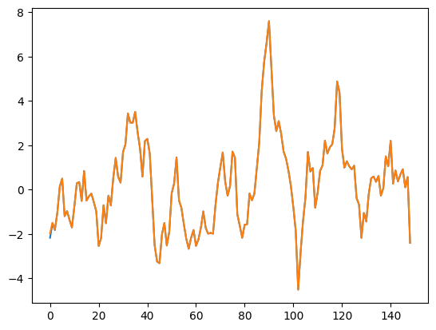
    


```python
inverse_x = tsa.ar_inverse(x, phi)
print(inverse_x.shape)
```

    (5, 148)


```python
plt.plot(w[0][2:])
plt.plot(inverse_x[0])
plt.show()
```


    
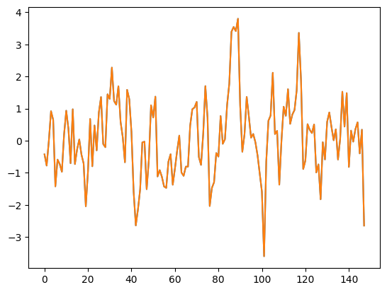
    


```python
inverse_w = tsa.ma_inverse(w, theta)
print(inverse_w.shape)
```

    (5, 147)


```python
plt.plot(e[0][-147:])
plt.plot(inverse_w[0])
plt.show()
```


    
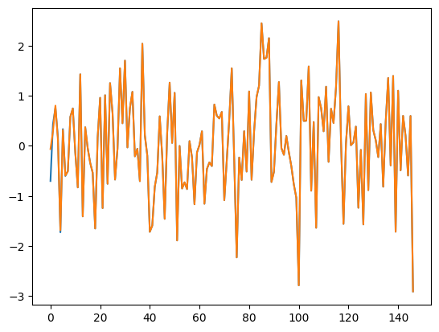
    


#### Example: ARMA(1,1) + GARCH(1,1) fit using the inverse functions


```python
# simulated data
e = tsa.gh(qf.normal(2000), w=0.1, alpha=0.3, beta=0.6)[0]
w = tsa.ma(e, theta=0.8)
data = tsa.ar(w, phi=0.5, mu=2.0)
```


```python
plt.plot(data)
```


    [<matplotlib.lines.Line2D at 0x7669f85c7b90>]


    
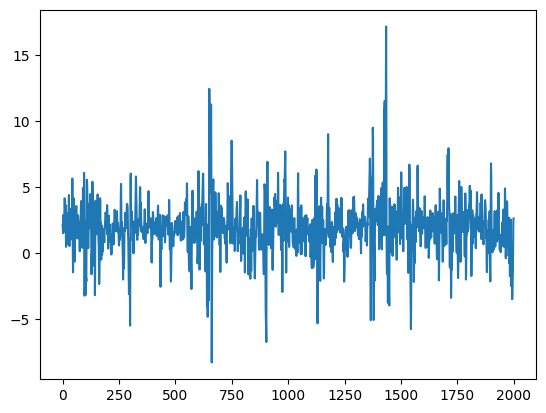
    


```python
from scipy.optimize import minimize
```


```python
def arma_1_1_garch_1_1_log_likelihood(params, data):
    # Parameters
    mu, phi, theta, omega, alpha, beta = params

    N = len(data)
    w = tsa.ar_inverse(data-mu, phi=phi)
    e = tsa.ma_inverse(w, theta=theta)
    z, sigma2 = tsa.gh_inverse(e, w=omega, alpha=alpha, beta=beta)

    log_likelihood = -0.5 * N * np.log(2 * np.pi)
    log_likelihood -= 0.5 * np.sum(np.log(sigma2) + z**2)
    return -log_likelihood  # Negative log-likelihood for minimization

# Initial parameter guess 
initial_params = [0.0, 0.1, 0.1, 0.1, 0.1, 0.1]

bounds = [
    (None, None),  # mu
    (-1, 1),       # phi1
    (None, None),  # theta12
    (1e-8, None),  # omega > 0
    (1e-8, 1),     # 0 <= alpha <= 1
    (1e-8, 1)      # 0 <= beta <= 1
]

y = data
# Optimize log-likelihood
result = minimize(arma_1_1_garch_1_1_log_likelihood, initial_params, args=(y,), bounds=bounds)
fitted_params = result.x

print("Fitted Parameters:", fitted_params)
print("fitted_log_likelihood = ", - result.fun)
print("AIC = ", -2 * -result.fun + 2 * len(result.x))
print("BIC = ", -2 * -result.fun + len(result.x) * np.log(y.size).item())
```

    Fitted Parameters: [2.00207328 0.51945168 0.79517484 0.08202248 0.33269634 0.60103715]
    fitted_log_likelihood =  -2575.529401410069
    AIC =  5163.058802820138
    BIC =  5196.66421757739


### Autovariance and Autocorrelation
acovf(series, nlags) \
acf(series, nlags, qstat=False, dof_offset=0)


```python
tsa.acf(data, nlags=5, qstat=True)
```


    (array([1.        , 0.74846902, 0.36215007, 0.15446444, 0.06303216,
            0.03298029]),
     array([1122.09319475, 1384.92367546, 1432.76167471, 1440.73166649,
            1442.91469901]),
     array([0., 0., 0., 0., 0.]))


```python
data_acf = tsa.acf(data, nlags=15)
plt.stem(data_acf, markerfmt='')
```


    <StemContainer object of 3 artists>


    
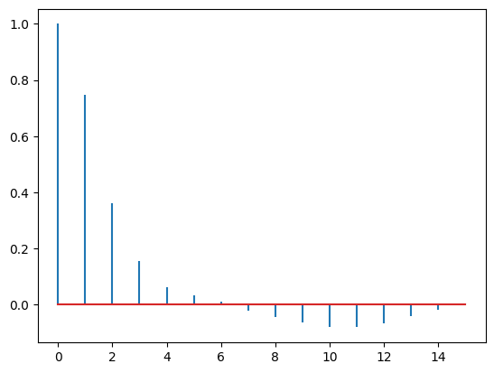
    


#### Other Tools
sliding_window(a, window) \
normal_cdf(x, mu=0.0, sigma=1.0) \
normal_pdf(x, mu=0.0, sigma=1.0) \
chi2_cdf(x, df) \
chi2_pdf(x, df) \
trimmed_mean(series, trim=None, axis=-1) \
mad(series, calib=1.4826, axis=-1): Mean absolute deviation \
pct_change(series, axis=-1) \
log_change(series, axis=-1) \


```python
x = qf.normal(10)
x
```


    array([-1.81506319, -0.06177757,  0.81406117, -0.13047454, -0.08597478,
           -0.18929597,  0.84590606,  0.92444569,  0.88397027, -0.39034777])


```python
qf.sliding_window(x, 4)
```


    array([[-1.81506319, -0.06177757,  0.81406117, -0.13047454],
           [-0.06177757,  0.81406117, -0.13047454, -0.08597478],
           [ 0.81406117, -0.13047454, -0.08597478, -0.18929597],
           [-0.13047454, -0.08597478, -0.18929597,  0.84590606],
           [-0.08597478, -0.18929597,  0.84590606,  0.92444569],
           [-0.18929597,  0.84590606,  0.92444569,  0.88397027],
           [ 0.84590606,  0.92444569,  0.88397027, -0.39034777]])


```python
qf.normal_cdf(0, mu=0.0, sigma=1.0)
```


    0.5


```python
qf.normal_pdf(0, mu=0.0, sigma=1.0)
```


    0.3989422804014327


```python
qf.chi2_cdf(5, 4)
```


    np.float64(0.7127025048163542)


```python

```
